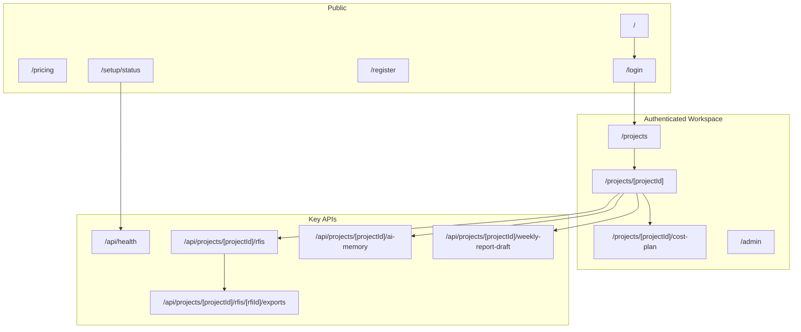
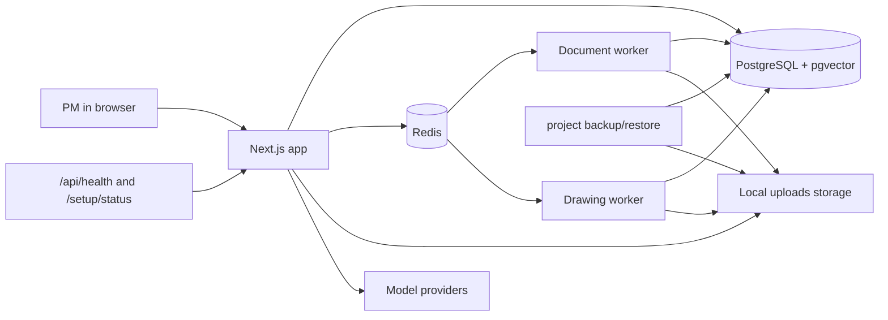
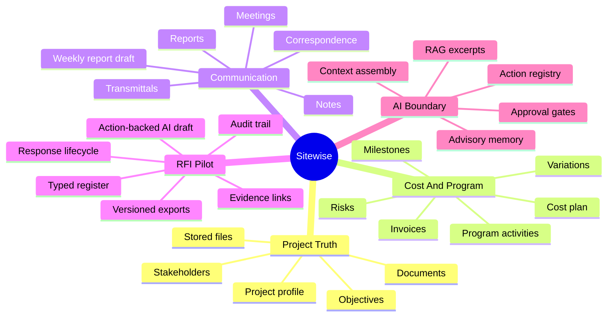
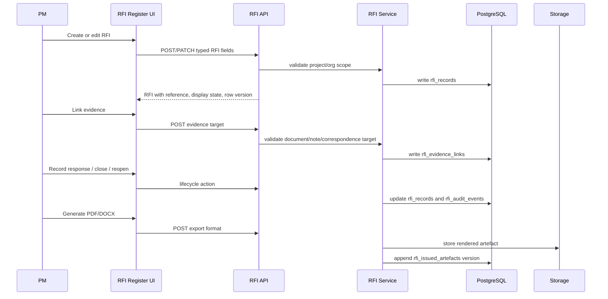
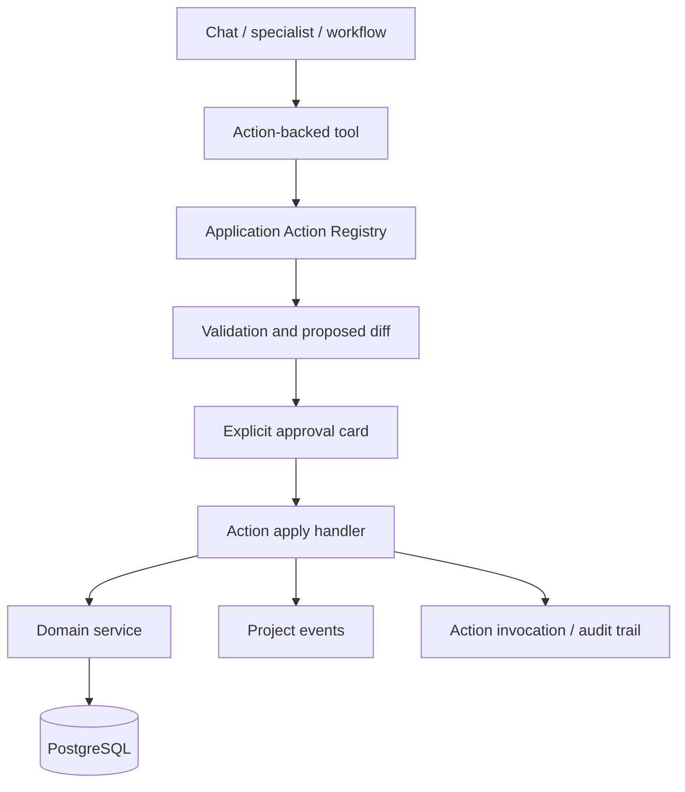
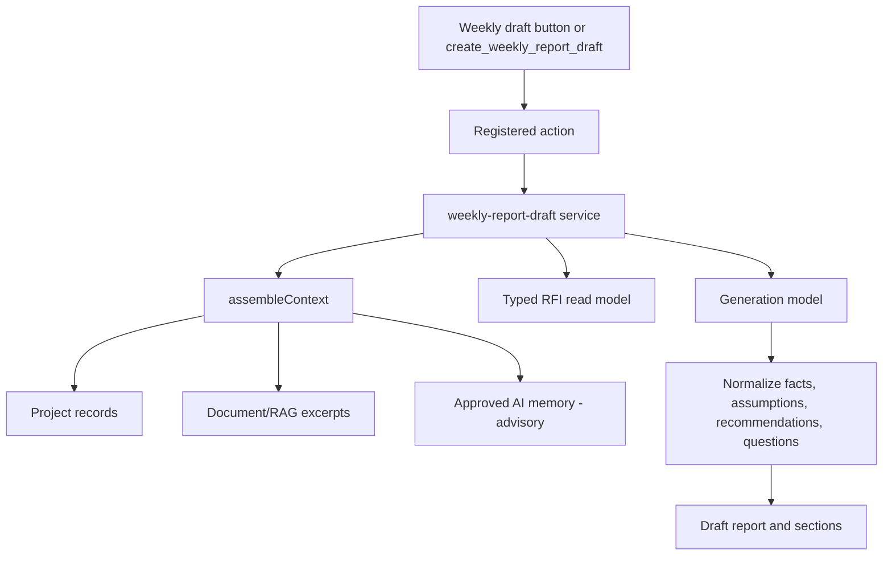

# Sitewise Visual Architecture Map

This map reflects the current local/private appliance shape after the May 14 RFI and setup work.

## Route Map

## Local Appliance

## Workspace Domains

## Typed RFI Flow

## Agent Write Boundary

## Weekly Report Draft

