# Assemble.ai — Visual Architecture Map

> Render in VSCode with the **Markdown Preview Mermaid Support** extension, or open in any Mermaid-aware viewer.

---

## 1. Application Route Map

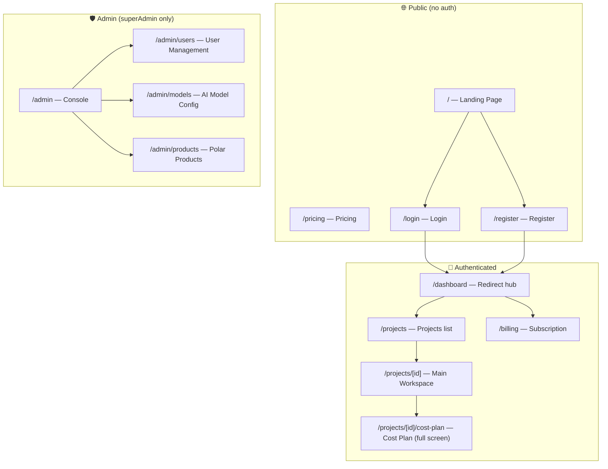

---

## 2. Main Workspace — Three-Panel Layout

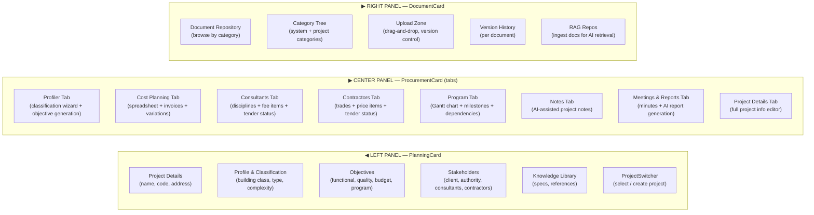

---

## 3. Feature Map by Domain

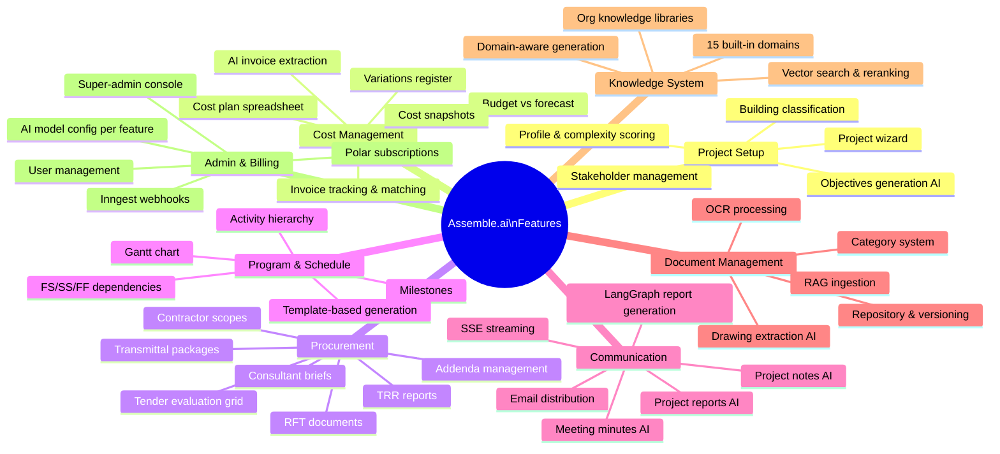

---

## 4. API Layer — Domains Map

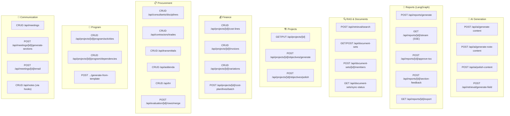

---

## 5. AI / RAG Pipeline — End to End

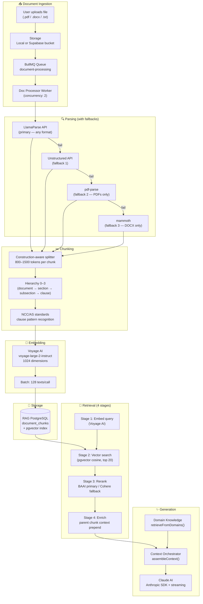

---

## 6. Context Orchestrator — Modules

```mermaid
graph LR
    subgraph Request["ContextRequest"]
        REQ["projectId\ncontextType\ntask\nnoteId / sectionKey\ndomainTags"]
    end

    subgraph Modules["Context Modules (fetched in parallel)"]
        M1["profile\n(building class, complexity, region)"]
        M2["projectInfo\n(name, address, contacts)"]
        M3["costPlan\n(budget, forecast, variations, invoices)"]
        M4["program\n(activities, milestones, critical path)"]
        M5["risks\n(risk register)"]
        M6["procurement\n(consultants, contractors, tender status)"]
        M7["stakeholders\n(all parties)"]
        M8["starredNotes\n(meeting notes in period)"]
        M9["ragDocuments\n(retrieved chunks)"]
        M10["procurementDocs\n(RFT, Addenda, TRR)"]
        M11["attachedDocuments\n(note-specific)"]
        M12["planningCard\n(profiler snapshot)"]
    end

    subgraph Output["AssembledContext"]
        O1["projectSummary"]
        O2["moduleContext (markdown)"]
        O3["knowledgeContext (domains)"]
        O4["crossModuleInsights"]
    end

    Request --> Modules --> Output
```

---

## 7. Database Architecture

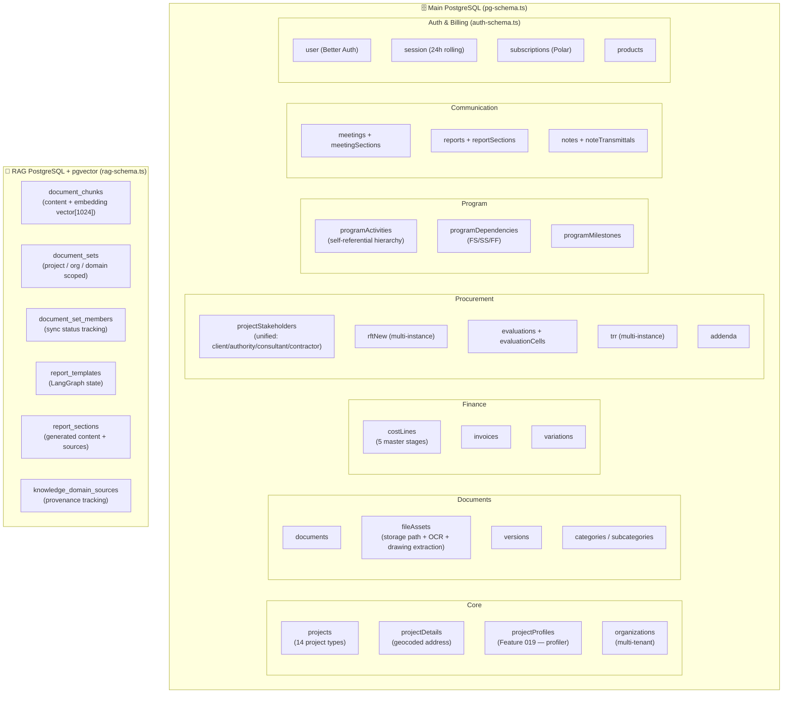

---

## 8. Background Workers & Queue System

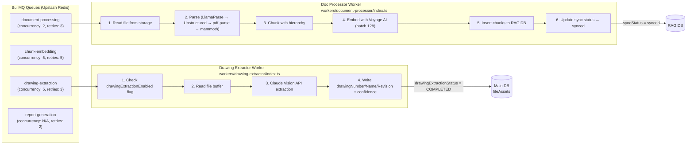

---

## 9. Authentication & Billing Flow

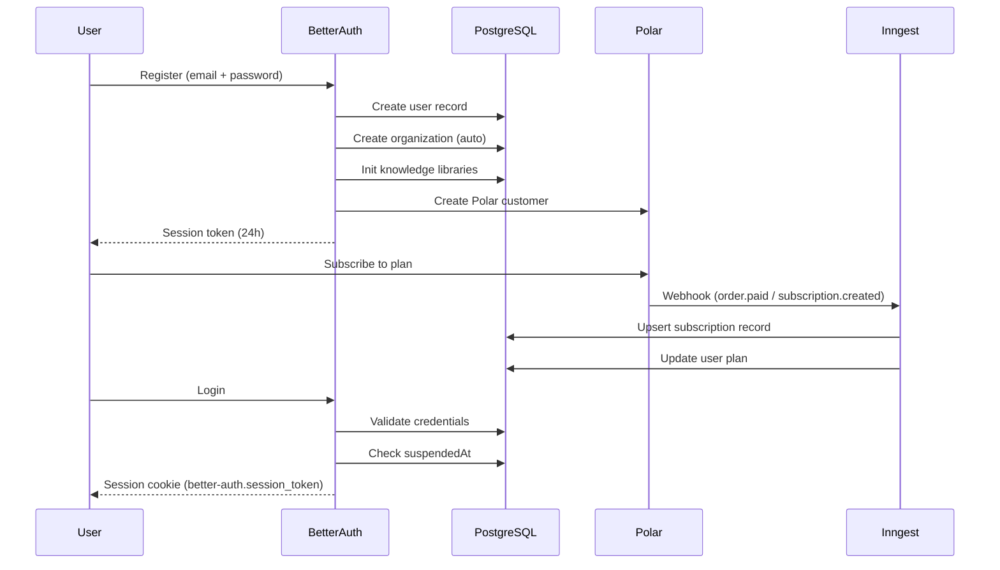

---

## 10. External Integrations Map

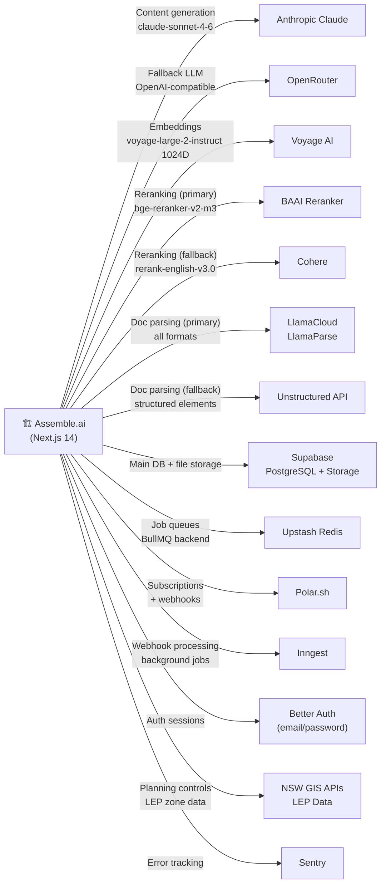

---

## 11. LangGraph Report Generation Flow

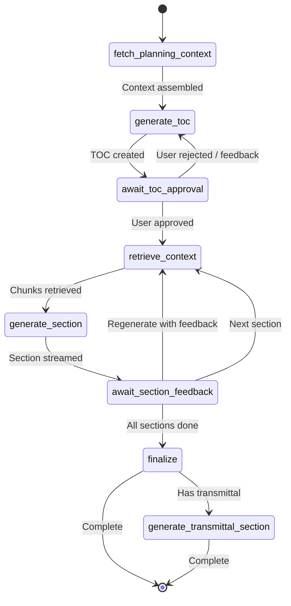

---

## 12. Key Data Flow — Note with AI Generation

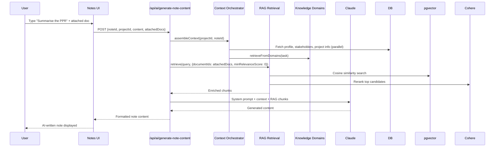
