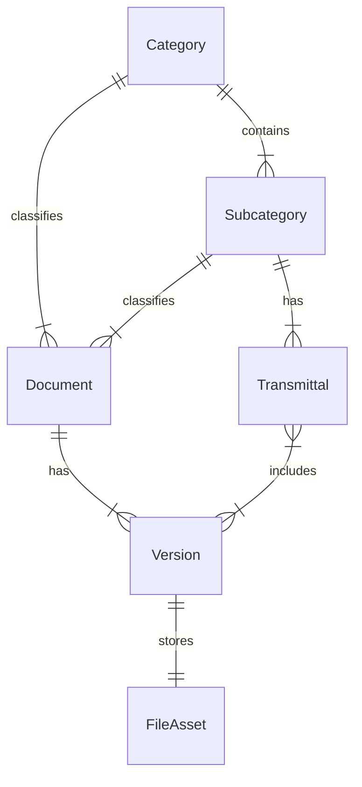

# Data Model: Intelligent Document Repository

## Entities

### Document
Represents the abstract concept of a "file" that persists across versions.

| Field | Type | Description |
|-------|------|-------------|
| `id` | UUID | Unique identifier |
| `categoryId` | UUID | FK to Category |
| `subcategoryId` | UUID | FK to Subcategory (optional) |
| `createdAt` | ISO8601 | When the document was first created |
| `updatedAt` | ISO8601 | When metadata or version was last updated |
| `tags` | Array<String> | Flexible tags for ad-hoc organization |

### Category
Dynamic categorization (seeded with mandatory defaults).

| Field | Type | Description |
|-------|------|-------------|
| `id` | UUID | Unique identifier |
| `name` | String | e.g., "Planning", "Design" |
| `isSystem` | Boolean | If true, cannot be deleted (Mandatory ones) |

### Subcategory
Dynamic sub-categorization (seeded with defaults).

| Field | Type | Description |
|-------|------|-------------|
| `id` | UUID | Unique identifier |
| `categoryId` | UUID | FK to Category (Parent) |
| `name` | String | e.g., "Structural", "Plumber" |
| `isSystem` | Boolean | If true, cannot be deleted |

### Version
A specific iteration of a document.

| Field | Type | Description |
|-------|------|-------------|
| `id` | UUID | Unique identifier |
| `documentId` | UUID | FK to Document |
| `versionNumber` | Integer | Sequential version number (1, 2, 3) |
| `label` | String | Display label (e.g., "Rev A", "V2") |
| `fileAssetId` | UUID | FK to FileAsset |
| `uploadedAt` | ISO8601 | Timestamp of upload |
| `uploadedBy` | String | User ID/Name |

### FileAsset
The physical binary file stored on disk.

| Field | Type | Description |
|-------|------|-------------|
| `id` | UUID | Unique identifier |
| `storagePath` | String | Relative path to file on disk |
| `originalName` | String | Original filename at upload |
| `mimeType` | String | e.g., application/pdf, image/png |
| `sizeBytes` | Integer | File size |
| `hash` | String | SHA-256 hash for integrity/deduplication |
| `ocrStatus` | Enum | `PENDING`, `PROCESSING`, `COMPLETED`, `FAILED` |
| `ocrText` | String | Extracted text (optional/blob) |

### Transmittal (formerly DocumentSchedule/Context)
A saved selection of documents associated with a specific subcategory, used for issuing packages.

| Field | Type | Description |
|-------|------|-------------|
| `id` | UUID | Unique identifier |
| `subcategoryId` | UUID | FK to Subcategory (The discipline this transmittal belongs to) |
| `name` | String | e.g., "Tender Package A" |
| `documentVersionIds` | Array<UUID> | List of specific versions included |
| `status` | Enum | `DRAFT`, `ISSUED` |
| `issuedAt` | ISO8601 | When the transmittal was finalized |
| `updatedAt` | ISO8601 | Last modified |

## Relationships

## Default Data (Seeded)

### Categories
- `Planning`, `Scheme Design`, `Detail Design`, `Procurement`, `Delivery`, `Consultants`, `Contractors`, `Administration`, `Cost Planning`

### Subcategories (Consultants)
- `Access`, `Acoustic`, ... (Full list from Spec)

### Subcategories (Contractors)
- `Earthworks`, `Concrete`, ... (Full list from Spec)
